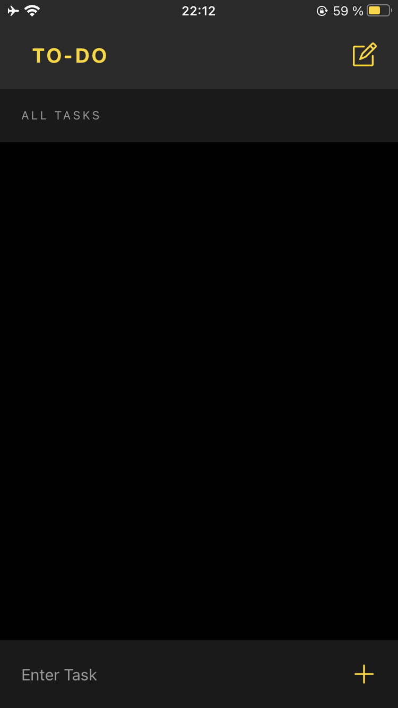
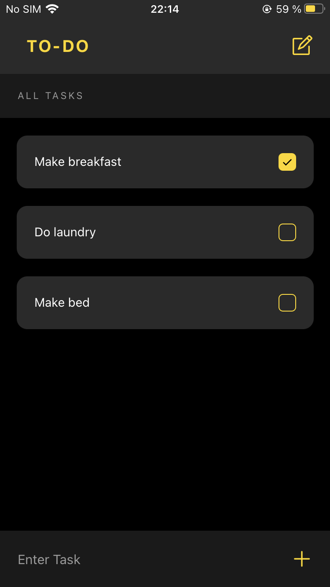

# TO-DO Application
 ## About
 A simple to-do list application built with react native
 ## Screenshots
 

 

 ## Developmental Preview
 The below developmental previews can be viewed on your device by downloading the Expo Go app. <strong>Note: </strong> The QR Codes wont work without the Expo Go App installed on your device.
 ## iOS Preview
 Scan the QR Code below using the camera app on your phone to view the developmental preview.

 ## Android Preview
 Scan the QR Code below on the Expo go app on your android device to view the developmental preview.

